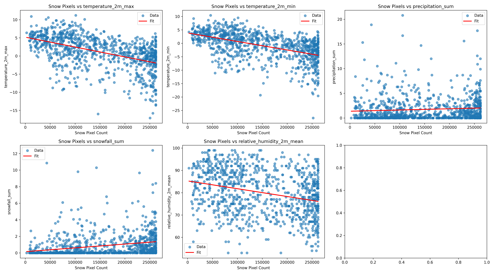

# ❄️ Climate Modeling Using SAR Imagery

This repository contains the source code and jupyter notebook of the project on snow cover segmentation and climate analysis using Synthetic Aperture Radar (SAR) satellite imagery. The aim is to study snow distribution patterns and their correlation with climatic variables across seasons, leveraging deep learning and visual analysis techniques.

---

## 📂 Repository Structure

```
.
├── Snow_Masks.ipynb    # Main notebook with full analysis pipeline
├── unet.py                            # U-Net model architecture for snow segmentation
├── unet_train.py                      # Training script for the U-Net model
├── unet_inference.py                  # Inference script to predict snow masks
├── SAM.py                             # Script to run Segment Anything Model (SAM) on SAR images
├── plots/                             # PNG visualizations: activation maps & climate trends
├── README.md                          # Project documentation
```

---

## 🛰️ Project Summary

### ❄️ Objective:

To perform snow cover segmentation on SAR satellite images and analyze its correlation with climate variables like temperature, precipitation, humidity, and snowfall.

### 📌 Key Components:

* **Data**: Triplets of SAR image (from Sentinel1), RGB image, and the snow cover mask derived using Normalized Difference Fractional Snow Index (NDFSI). The dataset before curation was of size 4K+, but after curation reduced to 1085 images. Beside, Openmeteo Archive API is used to collect the climate parameters such as temperature, humidity, precipitation, snowfall, etc.
* **Segmentation Models**:

  * **U-Net**: Custom architecture trained from scratch on SAR snow masks.
  * **SAM (Segment Anything Model)**: For advanced segmentation benchmarking.
 
* **Feature Visualization**:

  * Activation maps generated using **CLIP**, **DINOv2**, and **DeepLabV3**.
  * t-SNE plots comparing RGB and SAR image embeddings using a custom CLIP-style model.

### 📈 Climate Analysis:

* SAR imagery is paired with meteorological variables from Open-Meteo data.
* Seasonal trend plots are generated (Winter, Spring, Fall).
* Linear regression fits on snow cover vs. climatic variables.
* Time series of snow pixel counts over months/years.

---


## 🧠 **My Learning From This Work**

1. This project has been a good chance for me to explore the recent advances in multimodal learning (VLM, LLM, LMM) as much as I want. I could thoroughly read some good papers and online blogs (mentioned in the reference section at the end), as I could spend all of my waking hours for four days after the end of the semester just for this project. This project has personal relevance for me as I start my **Machine Learning Ph.D. at CMU this Fall 2025, focusing on multimodal learning and Computer Vision**. This was also a chance to *code* to use multimodal pre-trained models, analyse their architecture, use the Hugging Face library, and learn from failure. I especially enjoyed reading articles from [https://distill.pub/](https://distill.pub/) as I was very fascinated by some new concepts like [multimodal neuron](https://distill.pub/2021/multimodal-neurons/) and [differentiable image parameterisations](https://distill.pub/2018/differentiable-parameterizations/).

2. This was the first time I single-handedly collected, curated and pre-processed a significantly huge dataset from different resources. Searching for the appropriate resource was indeed time-consuming and was finalised after multiple failed experiments with different resources. Finally, I plan to open-source this curated dataset when I submit my journal to IEEE TGRS.

3. This is also my first project on Satellite imaging, so I had to learn multiple new terminologies and domain-specific concepts. For easy reference, I have presented them very precisely in the beginning.

---

### **Relation with Content Taught in Class**

1. The concept that dataset collection is not dataset curation that Sir told us in class is proven true. After curation, the dataset size was reduced to only one-third.

2. Feature map/ activation map visualisation after each layer of any kind of CNN network. I experimented with pre-trained models like CLIP, Dinov2, and DeepLabV3.

3. Linear regression was extensively taught in class. I reduced the multimodal problem to multiple linear regression problems for climate modelling. I could predict important and interesting insights based on the regression results.

4. Dimensionality reduction using PCA was another topic extensively taught in class. Here, I tried to reduce the dimensionality of CLIP embeddings in a 2D plot using PCA and derived an interesting conclusion about the domain mismatch between SAR and RGB images.

5. One thing I learned from Sir is to be extremely curious and explore things in depth. This project overall is a showcase of that learning and effort.

----

### **Some Interesting Conclusions**

1. As temperature (both min and max) decreases, snow cover increases.
2. As precipitation and snowfall amount increase, snow cover increases.
3. As humidity decreases, snow cover increases.
4. Just 10 years of data are too few to predict climate change. The fact is that the maximum temperature has risen only slightly over the years. But it has indeed increased with time. And from the last plot, we saw that with temp, snow cover changes significantly. One more observation is that in winter and fall, the snow cover has indeed decreased over the years, though very slightly.


5. The CLIP embeddings of SAR and RGB in the reduced dimensional feature space are just a translated (shifted version) of each other. So, I could identify the nature of the domain mismatch clearly. RGB images capture visible light with fine-grained textures and colours, while SAR captures backscattered microwave signals, sensitive to surface roughness, structure, and dielectric properties. My subsequent research can be to compensate for this domain mismatch by projecting into this shared embedding space. And after that, we can use the snow mask derived from the aligned/registered RGB image as the ground truth to segment the SAR image. 

----

## 📓 Getting Started

### 🔧 Requirements:

* Python ≥ 3.8
* PyTorch
* torchvision
* OpenCV
* pandas, matplotlib, seaborn
* scikit-learn
* PIL

Install dependencies:

```bash
pip install -r requirements.txt
```

### 🚀 Running the Notebook:

The main notebook contains:

* Motivation, Objective, Related Work of multimodal learning, my learning, relation with the course DA623, some interesting insights and outcomes, and a few preliminary discussion on satellite imaging.
* Data pairing logic (SAR + weather CSVs)
* Snow segmentation performance
* Activation map visualization
* Time series and regression plots
* Seasonal snow behavior analysis

---

## 📸 Visualizations

* PNGs of activation maps from CLIP, DINOv2, and DeepLabV3 are saved in the `plots/` directory.
* t-SNE projection of embeddings distinguishes SAR and RGB modalities.
* Time series plots of snow cover across various months and regions.





---


## 📌 TODO

* [ ] Compile the results in a manuscript and submit to IEEE Transactions on Geosciences and Remote Sensing.
* [ ] Propose a novel segmentation model to improve the accuracy of cross-domain segmentation

---

## 🧾 License

This project is released under the MIT License.

---

